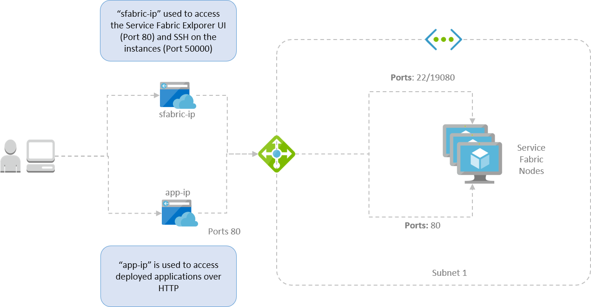

# Overview

A sample module for creating a Service Fabric DEV environments on Azure. This terraform [module](https://registry.terraform.io/modules/Bee-Projects/sfabric/azure) sets up the following deployment on Azure.

The module creates two "Frontend IP Configurations" for the Azure load balancer below - one attached to a `sfabric-ip` and another attached to a `app-ip`.

The `sfabric-ip` targets port `19080` to serve up the Service Fabric Explorer UI. The same IP also has inbound NAT rules to allow SSH on to the single instance that is created in the VM Scale Set. The terraform module uses your `~/.id/rsa.pub` as the public key that is allowed SSH access on to the VM.

The `app-ip` targets port 80 on the Service Fabric node.  Any web application you deploy, therefore, can be access via the DNS associated with `app-ip`.

